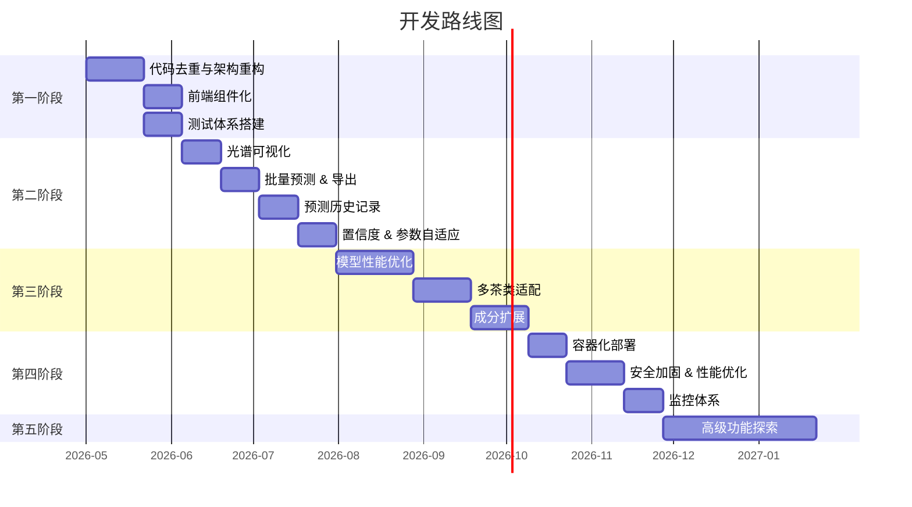

# 🗺️ 茶叶成分高光谱预测系统 — 后续开发路线图

> **文档版本**: v1.0  
> **创建日期**: 2026-05-04  
> **当前系统版本**: v0.1.0

---

## 📌 现状概述

当前系统已实现基本的端到端预测流程：

| 模块   | 现状                                                                 |
| ------ | -------------------------------------------------------------------- |
| 后端   | FastAPI 单文件架构，模型定义内联于 `api.py`，单一 `/api/predict` 接口 |
| 前端   | Vue 3 单组件 (`App.vue`)，支持文件上传与四组分结果展示                |
| 模型   | SpecTeaFormer（2层 Transformer Encoder, 4 头注意力），预测 4 种成分   |
| 数据   | 支持 `.dat` BIL 格式高光谱图像（512×512×204 波段）                   |
| 部署   | 本地开发模式运行，无容器化或生产级部署方案                           |

---

## 🔴 第一阶段：代码质量与架构优化（优先级：高）

> 目标：消除技术债务，建立可维护的代码基础

### 1.1 消除模型定义代码重复

**现状问题**：`api.py` 和 `utils/predict_components.py` 中存在完全相同的模型类定义（`PositionalEncoding`、`MultiHeadAttention`、`TransformerRegressor` 等），共约 180 行重复代码。

**改进方案**：
- 将模型定义统一收敛到 `utils/SpecTeaFormer.py`（该文件已存在但未被引用）
- `api.py` 和 `predict_components.py` 统一从该模块导入
- 模型配置参数提取为独立的 `config.py` 或 `config.yaml`

```text
backend/
├── config.py                 # 新增：集中管理模型配置、路径等
├── utils/
│   ├── SpecTeaFormer.py      # 唯一的模型定义源
│   ├── ReadHyperspectrum.py
│   └── predict_components.py # 移除内联模型定义，改为导入
└── api.py                    # 移除内联模型定义，改为导入
```

### 1.2 后端架构重构

**现状问题**：所有逻辑集中在 `api.py` 单文件中（322 行），包括模型定义、加载、预测、API 路由。

**改进方案**：
- 采用分层架构（路由层 / 服务层 / 数据层）
- 引入依赖注入管理模型实例

```text
backend/
├── app/
│   ├── __init__.py
│   ├── main.py              # FastAPI 应用入口 & 中间件配置
│   ├── config.py             # 配置管理（Pydantic Settings）
│   ├── routers/
│   │   ├── predict.py        # 预测相关路由
│   │   └── health.py         # 健康检查路由
│   ├── services/
│   │   ├── model_service.py  # 模型加载与推理服务
│   │   └── spectrum_service.py # 光谱数据处理服务
│   ├── models/               # Pydantic 数据模型（请求/响应）
│   │   └── schemas.py
│   └── core/
│       └── transformer.py    # SpecTeaFormer 模型定义
├── weights/                  # 预训练权重文件
└── tests/                    # 单元测试
```

### 1.3 前端组件化拆分

**现状问题**：整个前端 UI 集中在单个 `App.vue`（397 行），无路由、无组件拆分。

**改进方案**：
- 拆分为独立组件：`FileUploader.vue`、`ResultCard.vue`、`StatusBar.vue`、`NavBar.vue`
- 引入 Vue Router，为后续多页面扩展做准备
- 将预测逻辑抽离为 composable（`usePrediction.ts`）

### 1.4 测试体系搭建

- **后端**：使用 `pytest` + `httpx` 编写 API 集成测试、模型推理单元测试
- **前端**：使用 `Vitest` + `@vue/test-utils` 编写组件测试
- **CI/CD**：配置 GitHub Actions 自动运行测试流水线

---

## 🟡 第二阶段：功能增强（优先级：中高）

> 目标：丰富系统能力，提升用户体验

### 2.1 光谱可视化

**当前缺失**：用户上传数据后无法查看原始光谱曲线，缺乏数据透明度。

**实现方案**：
- 后端新增接口返回预处理后的光谱数据（波长-吸光度曲线）
- 前端集成 [ECharts](https://echarts.apache.org/) 或 [Chart.js](https://www.chartjs.org/) 绘制：
  - 原始反射率曲线
  - 一阶导数曲线
  - 注意力权重热力图（可视化模型关注的关键波段）

### 2.2 批量预测支持

- 支持多文件同时上传与批量预测
- 后端新增 `/api/predict/batch` 接口
- 前端展示批量预测结果汇总表格，支持 CSV/Excel 导出

### 2.3 预测结果导出

- 支持导出为 PDF 报告（含光谱图、成分分析结果、语义评价）
- 支持导出为 CSV / JSON 格式
- 报告模板可定制

### 2.4 预测历史记录

**现状问题**：每次预测结果仅在前端临时展示，刷新即丢失。

**实现方案**：
- 引入轻量级数据库（SQLite / PostgreSQL）
- 存储每次预测的：上传文件名、预测时间、四组分结果、光谱特征摘要
- 前端新增"历史记录"页面，支持查看、对比、搜索

### 2.5 置信度评估（真实值）

**现状问题**：前端置信度显示硬编码为 `99.1%`，非真实模型输出。

**改进方案**：
- 模型输出层增加不确定性估计（MC Dropout / 集成方法）
- 后端返回每个成分的预测区间和置信度
- 前端动态展示真实置信度分数

### 2.6 高光谱参数自适应

**现状问题**：`ReadHyperspectrum.py` 中硬编码了 `rows=512, cols=512, bands=204`，仅适配单一设备。

**改进方案**：
- 支持读取 ENVI `.hdr` 头文件自动解析数据维度和格式
- 兼容 BSQ / BIL / BIP 多种存储格式
- 支持更多高光谱文件格式（`.raw`、`.tif`、ENVI 标准格式）

---

## 🟢 第三阶段：模型迭代与扩展（优先级：中）

> 目标：提升模型性能，扩展预测能力

### 3.1 模型性能优化

| 方向               | 说明                                                     |
| ------------------ | -------------------------------------------------------- |
| 数据增强           | 光谱平移、噪声注入、mixup 等策略增加训练样本多样性       |
| 预处理优化         | 引入 SNV（标准正态变量变换）、MSC（多元散射校正）等方法  |
| 架构升级           | 尝试更深层 Encoder、Cross-Attention 机制、或混合 CNN-Transformer |
| 超参数搜索         | 使用 Optuna 进行系统性超参数优化                         |
| 特征选择           | 基于注意力权重或 SHAP 值进行关键波段筛选                 |

### 3.2 多茶类适配

- 当前模型可能仅针对特定茶类训练
- 扩展支持：绿茶、红茶、乌龙茶、白茶、黑茶等不同茶类
- 引入茶类自动识别模块（分类 + 回归联合模型）

### 3.3 预测成分扩展

- 当前仅预测 4 种成分（儿茶素、咖啡因、茶氨酸、茶碱）
- 未来可扩展：
  - **水分含量** — 影响茶叶储存与品质
  - **多酚总量** — 综合抗氧化指标
  - **氨基酸总量** — 鲜味品质指标
  - **挥发性香气成分** — 结合 GC-MS 数据建模

### 3.4 模型版本管理

- 引入 MLflow 或 DVC 进行模型版本追踪
- 支持 A/B 测试不同版本模型
- 模型更新时支持热替换（Hot Swap），无需重启服务

---

## 🔵 第四阶段：生产化部署（优先级：中低）

> 目标：构建稳定、可扩展的生产级系统

### 4.1 容器化部署

```yaml
# docker-compose.yml 示意
services:
  backend:
    build: ./backend
    ports: ["8000:8000"]
    volumes:
      - ./backend/weights:/app/weights
    deploy:
      resources:
        reservations:
          devices:
            - capabilities: [gpu]  # GPU 支持

  frontend:
    build: ./frontend
    ports: ["3000:80"]

  nginx:
    image: nginx:alpine
    ports: ["80:80"]
    # 反向代理配置
```

### 4.2 安全加固

| 项目             | 现状                           | 改进                                         |
| ---------------- | ------------------------------ | -------------------------------------------- |
| CORS             | `allow_origins=["*"]`          | 限制为实际前端域名                           |
| 认证             | 无                             | JWT Token / API Key 认证                     |
| 文件上传         | 仅校验后缀名                   | 增加文件大小限制、内容校验、病毒扫描         |
| 速率限制         | 无                             | 引入 `slowapi` 进行接口限流                  |
| 临时文件         | 手动清理                       | 使用 `tempfile` 模块自动管理，设置过期策略   |

### 4.3 性能优化

- **模型推理加速**：
  - TorchScript / ONNX Runtime 导出，加速 CPU 推理
  - TensorRT 编译优化 GPU 推理（与前端展示的说明一致）
- **异步任务队列**：
  - 大文件处理引入 Celery + Redis 异步任务队列
  - WebSocket 实时推送预测进度
- **缓存机制**：
  - 相同光谱数据的预测结果缓存（Redis）
  - 模型和标准化器预加载（已实现，可优化为单例模式）

### 4.4 监控与日志

- 引入结构化日志（`loguru` / `structlog`）
- Prometheus + Grafana 监控：
  - API 请求延迟 / 吞吐量
  - 模型推理耗时
  - GPU 利用率
- Sentry 异常追踪

---

## 🟣 第五阶段：高级功能（优先级：低 / 远期）

> 目标：面向科研与产业深度应用

### 5.1 多模态融合

- 结合 RGB 图像信息（茶叶外观）+ 高光谱数据
- 引入多模态 Transformer 架构（跨模态注意力）
- 提升小样本场景下的预测精度

### 5.2 用户系统与权限管理

- 多用户注册与登录
- 角色权限（管理员 / 研究员 / 访客）
- 个人预测历史与数据管理
- 团队协作与数据共享

### 5.3 在线模型训练（AutoML）

- 用户上传标定数据后，系统自动微调模型
- 提供训练进度可视化与模型评估报告
- 支持自定义模型参数调整

### 5.4 移动端适配

- 开发 PWA 版本或微信小程序
- 支持手机端数据采集设备对接
- 离线推理能力（ONNX.js / TensorFlow.js）

### 5.5 茶叶品质综合评分

- 基于多成分预测结果，结合专家规则或机器学习
- 输出综合品质评分（如百分制）
- 自动生成品质等级报告（特级 / 一级 / 二级 等）

---

## 📅 推荐实施顺序



---

## ⚡ 快速见效建议（Quick Wins）

以下改进成本较低但收益显著，建议立即实施：

1. **合并模型定义代码** — 消除 `api.py` 与 `predict_components.py` 的重复（~1小时）
2. **提取配置参数** — 模型配置、路径等写入独立配置文件（~30分钟）
3. **修复置信度硬编码** — 移除或替换前端 `CONFIDENCE: 99.1%` 为真实值（~1小时）
4. **添加 `.env` 管理** — 后端敏感配置使用环境变量管理（~30分钟）
5. **Docker 基础镜像** — 编写 Dockerfile 实现一键部署（~2小时）

---

*本路线图将随项目演进持续更新。*
